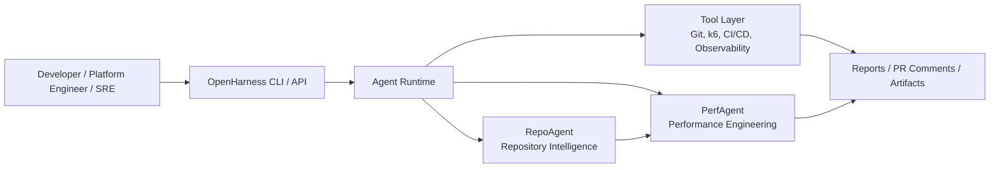
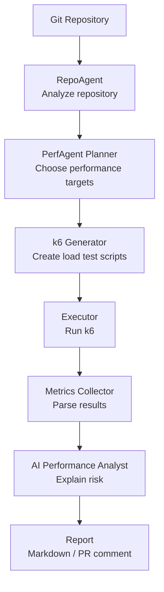
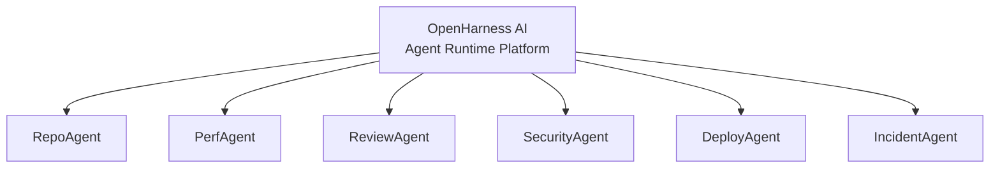
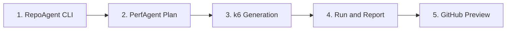

# OpenHarness AI

[](https://github.com/XTMay/openharness-ai/actions/workflows/ci.yml)
[](LICENSE)
[](pyproject.toml)

English | [简体中文](README.zh-CN.md)

OpenHarness AI is an open-source AI-native software delivery platform for building autonomous engineering agents.

The mission is to turn CI/CD platforms into AI-native engineering systems that can understand repositories, plan delivery workflows, run engineering tools, and explain results through auditable agent workflows.

The first flagship application is **PerfAgent**, an AI performance engineering agent that will analyze a repository, plan performance tests, generate k6 scripts, run tests, analyze metrics, and report performance risk back to developers.

## System Overview



## What Works Today

The first implemented tool is **RepoAgent Analyze**: a read-only CLI that scans a repository and produces a structured repository manifest.

```bash
openharness analyze --repo . --format text
```

Example output:

```text
OpenHarness RepoAgent Manifest

Repository: /path/to/repo
Files: 27
Bytes: 69258

Languages:
- Python: 10 files, 24740 bytes

Frameworks:
- FastAPI

API Routes:
- GET /health (FastAPI, app.py)

Infrastructure:
- Dockerfile
```

RepoAgent detects:

- Languages
- Package managers
- Frameworks
- API routes
- Service entrypoints
- Infrastructure files
- Test assets

## PerfAgent Workflow



## Why OpenHarness

AI coding assistants help write code. OpenHarness focuses on the rest of software delivery:

- Repository understanding
- Code and architecture review
- Performance engineering
- Security validation
- Deployment planning
- Incident analysis
- CI/CD governance

The long-term goal is an open agent ecosystem:



## Quickstart

```bash
git clone https://github.com/XTMay/openharness-ai.git
cd openharness-ai
python3.12 -m pip install -e ".[dev]"
openharness analyze --repo . --format text
pytest
```

## Roadmap



1. RepoAgent CLI: repository analysis and manifest generation.
2. PerfAgent Plan: rank performance-sensitive routes and create test plans.
3. PerfAgent k6 Generation: generate validated k6 scripts.
4. PerfAgent Run and Report: execute k6 and produce performance reports.
5. GitHub Preview: render PR comments in dry-run mode before publishing.

## Documentation

- [Architecture Document](docs/architecture.md)
- [Repository Structure](docs/repository-structure.md)
- [Technical Design](docs/technical-design.md)
- [MVP Roadmap](docs/mvp-roadmap.md)
- [Development Plan](docs/development-plan.md)
- [Contributing Guide](CONTRIBUTING.md)

## Project Principles

- Build a long-term open-source platform, not a disposable demo.
- Keep the core runtime small and extensible.
- Treat agents as workflow participants with explicit inputs, outputs, tools, and audit trails.
- Make every autonomous action observable, replayable, and governable.
- Start with PerfAgent as the killer application, then grow into an ecosystem of delivery agents.
