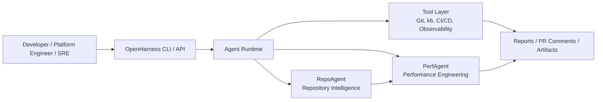
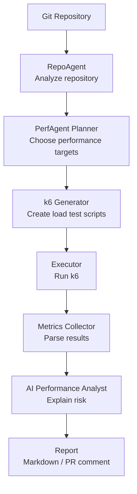
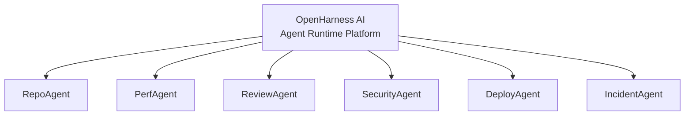
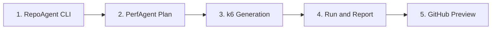

# OpenHarness AI

[](https://github.com/XTMay/openharness-ai/actions/workflows/ci.yml)
[](LICENSE)
[](pyproject.toml)

English | [简体中文](README.zh-CN.md)

OpenHarness AI is an open-source AI-native software delivery platform for building autonomous engineering agents.

The mission is to turn CI/CD platforms into AI-native engineering systems that can understand repositories, plan delivery workflows, run engineering tools, and explain results through auditable agent workflows.

The first flagship application is **PerfAgent**, an AI performance engineering agent that will analyze a repository, plan performance tests, generate k6 scripts, run tests, analyze metrics, and report performance risk back to developers.

## System Overview



## What Works Today

OpenHarness currently ships four low-risk workflows.

### RepoAgent Analyze

RepoAgent scans a repository and produces a structured repository manifest.

```bash
openharness analyze --repo examples/fastapi-service --format text
```

Reproducible example output:

```text
OpenHarness RepoAgent Manifest

Repository: /path/to/openharness-ai/examples/fastapi-service
Config: openharness.yaml
Files: 6
Bytes: 1853

Languages:
- Python: 2 files, 545 bytes

Frameworks:
- FastAPI (high confidence)

API Routes:
- GET /health (FastAPI, app/main.py)
- GET /products (FastAPI, app/main.py)
- POST /orders (FastAPI, app/main.py)
- POST /checkout (FastAPI, app/main.py)

Performance Targets:
- HIGH POST /checkout: Business-critical route keyword suggests performance sensitivity
- HIGH POST /orders: Business-critical route keyword suggests performance sensitivity
- HIGH GET /products: Business-critical route keyword suggests performance sensitivity

Infrastructure:
- Dockerfile
```

RepoAgent detects:

- Languages
- Package managers
- Frameworks
- API routes
- Performance target candidates
- Service entrypoints
- Infrastructure files
- Test assets

Output formats:

```bash
openharness analyze --repo examples/fastapi-service --format json
openharness analyze --repo examples/fastapi-service --format text
openharness analyze --repo examples/fastapi-service --format markdown
```

RepoAgent also supports `openharness.yaml` for real repositories that need custom ignore rules, service roots, production paths, or business-critical keywords.

### PerfAgent Plan

PerfAgent consumes RepoAgent output and creates an initial performance test plan.

```bash
openharness perf plan --repo examples/fastapi-service --format markdown
```

Example plan excerpt:

```text
OpenHarness PerfAgent Plan

Scenarios:
- HIGH POST /checkout
  load: 25 VUs for 3m
- HIGH POST /orders
  load: 25 VUs for 3m
- HIGH GET /products
  load: 25 VUs for 3m
```

PerfAgent Plan does not run k6 yet. It validates that RepoAgent can provide useful performance targets for downstream agents.

### PerfAgent k6 Generation

PerfAgent can generate reviewable k6 scripts from the performance plan.

```bash
openharness perf generate --repo examples/fastapi-service --output .openharness/k6 --format text
```

Generated artifacts:

```text
.openharness/k6/
  post_checkout.js
  post_orders.js
  get_products.js
  config.json
  README.md
```

Generation does not execute k6. Scripts use `BASE_URL` and default to `http://localhost:8000` for local review.

### PerfAgent k6 Validation

Validate generated artifacts before running anything.

```bash
openharness perf validate --artifacts .openharness/k6
```

Validation checks artifact structure, `config.json`, generated scripts, stale scripts, `BASE_URL` usage, and k6 script shape. It does not run load tests or hit `BASE_URL`.

For CI, use strict mode to fail on warnings:

```bash
openharness perf validate --artifacts .openharness/k6 --strict
```

If k6 is installed and you explicitly want static k6 inspection, add `--with-k6-inspect`.

## PerfAgent Workflow



## Why OpenHarness

AI coding assistants help write code. OpenHarness focuses on the rest of software delivery:

- Repository understanding
- Code and architecture review
- Performance engineering
- Security validation
- Deployment planning
- Incident analysis
- CI/CD governance

The long-term goal is an open agent ecosystem:



## Quickstart

```bash
git clone https://github.com/XTMay/openharness-ai.git
cd openharness-ai
python3.10 -m pip install -e ".[dev]"
openharness analyze --repo . --format text
pytest
```

## Roadmap



1. RepoAgent CLI: repository analysis and manifest generation. Done.
2. PerfAgent Plan: rank performance-sensitive routes and create test plans. Done.
3. PerfAgent k6 Generation: generate reviewable k6 scripts. Done.
4. PerfAgent Validate: validate generated k6 artifacts without running tests. Done.
5. PerfAgent Run and Report: execute k6 and produce performance reports.
6. GitHub Preview: render PR comments in dry-run mode before publishing.

## Documentation

- [Architecture Document](docs/architecture.md)
- [Repository Structure](docs/repository-structure.md)
- [Technical Design](docs/technical-design.md)
- [MVP Roadmap](docs/mvp-roadmap.md)
- [Development Plan](docs/development-plan.md)
- [Translation Guide](docs/i18n.md)
- [RepoAgent Configuration](docs/repo-agent-configuration.md)
- [Repository Manifest Schema](docs/schemas/repository-manifest.schema.json)
- [Performance Plan Schema](docs/schemas/performance-plan.schema.json)
- [k6 Generation Result Schema](docs/schemas/k6-generation-result.schema.json)
- [k6 Validation Result Schema](docs/schemas/k6-validation-result.schema.json)
- [Contributing Guide](CONTRIBUTING.md)

## Project Principles

- Build a long-term open-source platform, not a disposable demo.
- Keep the core runtime small and extensible.
- Treat agents as workflow participants with explicit inputs, outputs, tools, and audit trails.
- Make every autonomous action observable, replayable, and governable.
- Start with PerfAgent as the killer application, then grow into an ecosystem of delivery agents.
