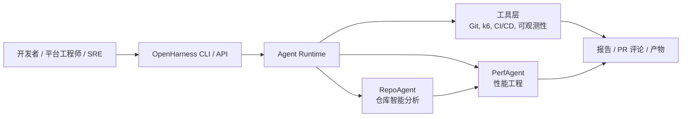
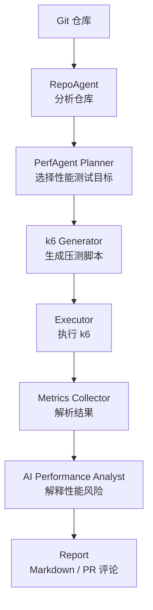
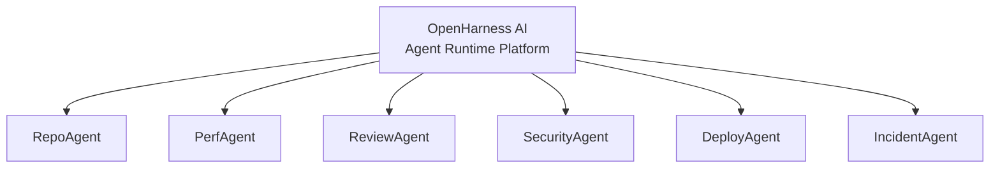
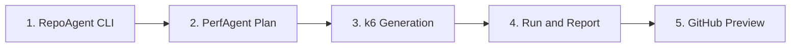

# OpenHarness AI

[](https://github.com/XTMay/openharness-ai/actions/workflows/ci.yml)
[](LICENSE)
[](pyproject.toml)

[English](README.md) | 简体中文

OpenHarness AI 是一个开源的 AI Native Software Delivery Platform，用来构建自主软件工程 Agent。

它的目标是把 CI/CD 平台升级为 AI Native 工程系统：能够理解代码仓库、规划交付流程、调用工程工具，并通过可审计的 Agent 工作流解释结果。

第一个旗舰应用是 **PerfAgent**：一个 AI 性能工程 Agent。它将分析代码仓库、规划性能测试、生成 k6 脚本、执行测试、分析指标，并把性能风险反馈给开发者。

## 系统概览



## 当前可用能力

OpenHarness 当前已经有三个低风险工作流。

### RepoAgent Analyze

RepoAgent 用来扫描仓库并生成结构化仓库画像。

```bash
openharness analyze --repo examples/fastapi-service --format text
```

可复现示例输出：

```text
OpenHarness RepoAgent Manifest

Repository: /path/to/openharness-ai/examples/fastapi-service
Config: openharness.yaml
Files: 6
Bytes: 1853

Languages:
- Python: 2 files, 545 bytes

Frameworks:
- FastAPI (high confidence)

API Routes:
- GET /health (FastAPI, app/main.py)
- GET /products (FastAPI, app/main.py)
- POST /orders (FastAPI, app/main.py)
- POST /checkout (FastAPI, app/main.py)

Performance Targets:
- HIGH POST /checkout: Business-critical route keyword suggests performance sensitivity
- HIGH POST /orders: Business-critical route keyword suggests performance sensitivity
- HIGH GET /products: Business-critical route keyword suggests performance sensitivity

Infrastructure:
- Dockerfile
```

RepoAgent 当前可以识别：

- 编程语言
- 包管理器
- Web 框架
- API 路由
- 性能测试候选目标
- 服务入口
- 基础设施文件
- 测试资产

输出格式：

```bash
openharness analyze --repo examples/fastapi-service --format json
openharness analyze --repo examples/fastapi-service --format text
openharness analyze --repo examples/fastapi-service --format markdown
```

RepoAgent 也支持 `openharness.yaml`，适合真实仓库自定义忽略规则、服务根目录、生产代码路径和业务关键字。

### PerfAgent Plan

PerfAgent 会消费 RepoAgent 输出，并生成初始性能测试计划。

```bash
openharness perf plan --repo examples/fastapi-service --format markdown
```

示例计划片段：

```text
OpenHarness PerfAgent Plan

Scenarios:
- HIGH POST /checkout
  load: 25 VUs for 3m
- HIGH POST /orders
  load: 25 VUs for 3m
- HIGH GET /products
  load: 25 VUs for 3m
```

PerfAgent Plan 目前还不会执行 k6。它的价值是验证 RepoAgent 能否为下游 Agent 提供有用的性能测试候选目标。

### PerfAgent k6 Generation

PerfAgent 可以从性能测试计划生成可审查的 k6 脚本。

```bash
openharness perf generate --repo examples/fastapi-service --output .openharness/k6 --format text
```

生成产物：

```text
.openharness/k6/
  post_checkout.js
  post_orders.js
  get_products.js
  config.json
  README.md
```

生成阶段不会执行 k6。脚本使用 `BASE_URL`，本地审查时默认指向 `http://localhost:8000`。

## PerfAgent 工作流



## 为什么做 OpenHarness

AI 编程助手帮助开发者写代码。OpenHarness 关注的是软件交付中剩下的部分：

- 仓库理解
- 代码和架构审查
- 性能工程
- 安全验证
- 部署规划
- 故障分析
- CI/CD 治理

长期目标是形成一个开放的 Agent 生态：



## 快速开始

```bash
git clone https://github.com/XTMay/openharness-ai.git
cd openharness-ai
python3.10 -m pip install -e ".[dev]"
openharness analyze --repo . --format text
pytest
```

## 路线图



1. RepoAgent CLI：仓库分析和 manifest 生成。已完成。
2. PerfAgent Plan：识别性能敏感路由并生成测试计划。已完成。
3. PerfAgent k6 Generation：生成可审查的 k6 脚本。已完成。
4. PerfAgent Run and Report：执行 k6 并生成性能报告。
5. GitHub Preview：先以 dry-run 方式渲染 PR 评论，再发布。

## 文档

- [架构文档](docs/architecture.md)
- [仓库结构](docs/repository-structure.md)
- [技术设计](docs/technical-design.md)
- [MVP 路线图](docs/mvp-roadmap.md)
- [开发计划](docs/development-plan.md)
- [翻译指南](docs/i18n.md)
- [RepoAgent 配置](docs/repo-agent-configuration.md)
- [Repository Manifest Schema](docs/schemas/repository-manifest.schema.json)
- [Performance Plan Schema](docs/schemas/performance-plan.schema.json)
- [k6 Generation Result Schema](docs/schemas/k6-generation-result.schema.json)
- [贡献指南](CONTRIBUTING.md)

## 项目原则

- 构建长期可维护的开源平台，而不是一次性 demo。
- 保持核心 runtime 小而可扩展。
- 把 Agent 视为有明确输入、输出、工具和审计轨迹的工作流参与者。
- 让每个自主动作都可观测、可回放、可治理。
- 从 PerfAgent 这个 killer application 开始，逐步扩展为完整 Agent 生态。
