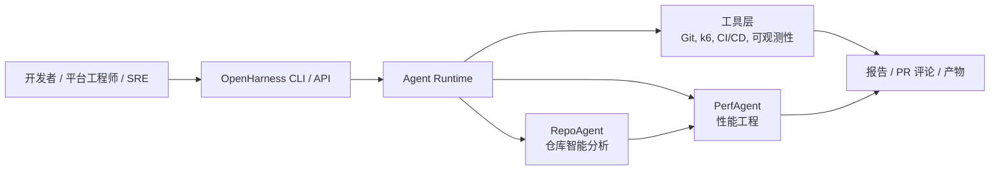
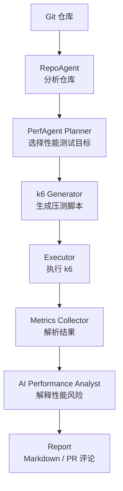
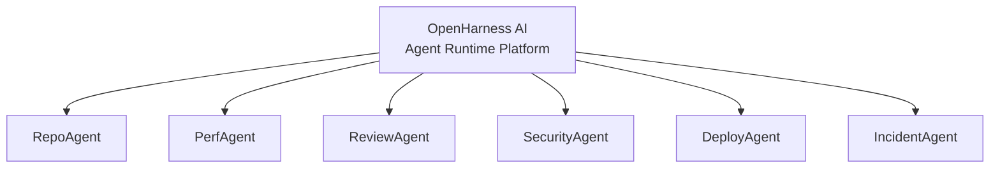
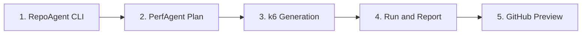

# OpenHarness AI

[](https://github.com/XTMay/openharness-ai/actions/workflows/ci.yml)
[](LICENSE)
[](pyproject.toml)

[English](README.md) | 简体中文

OpenHarness AI 是一个开源的 AI Native Software Delivery Platform，用来构建自主软件工程 Agent。

它的目标是把 CI/CD 平台升级为 AI Native 工程系统：能够理解代码仓库、规划交付流程、调用工程工具，并通过可审计的 Agent 工作流解释结果。

第一个旗舰应用是 **PerfAgent**：一个 AI 性能工程 Agent。它将分析代码仓库、规划性能测试、生成 k6 脚本、执行测试、分析指标，并把性能风险反馈给开发者。

## 系统概览



## 当前可用能力

第一个已实现的工具是 **RepoAgent Analyze**：一个只读 CLI，用来扫描仓库并生成结构化仓库画像。

```bash
openharness analyze --repo . --format text
```

示例输出：

```text
OpenHarness RepoAgent Manifest

Repository: /path/to/repo
Files: 27
Bytes: 69258

Languages:
- Python: 10 files, 24740 bytes

Frameworks:
- FastAPI

API Routes:
- GET /health (FastAPI, app.py)

Infrastructure:
- Dockerfile
```

RepoAgent 当前可以识别：

- 编程语言
- 包管理器
- Web 框架
- API 路由
- 服务入口
- 基础设施文件
- 测试资产

## PerfAgent 工作流



## 为什么做 OpenHarness

AI 编程助手帮助开发者写代码。OpenHarness 关注的是软件交付中剩下的部分：

- 仓库理解
- 代码和架构审查
- 性能工程
- 安全验证
- 部署规划
- 故障分析
- CI/CD 治理

长期目标是形成一个开放的 Agent 生态：



## 快速开始

```bash
git clone https://github.com/XTMay/openharness-ai.git
cd openharness-ai
python3.10 -m pip install -e ".[dev]"
openharness analyze --repo . --format text
pytest
```

## 路线图



1. RepoAgent CLI：仓库分析和 manifest 生成。
2. PerfAgent Plan：识别性能敏感路由并生成测试计划。
3. PerfAgent k6 Generation：生成可校验的 k6 脚本。
4. PerfAgent Run and Report：执行 k6 并生成性能报告。
5. GitHub Preview：先以 dry-run 方式渲染 PR 评论，再发布。

## 文档

- [架构文档](docs/architecture.md)
- [仓库结构](docs/repository-structure.md)
- [技术设计](docs/technical-design.md)
- [MVP 路线图](docs/mvp-roadmap.md)
- [开发计划](docs/development-plan.md)
- [翻译指南](docs/i18n.md)
- [贡献指南](CONTRIBUTING.md)

## 项目原则

- 构建长期可维护的开源平台，而不是一次性 demo。
- 保持核心 runtime 小而可扩展。
- 把 Agent 视为有明确输入、输出、工具和审计轨迹的工作流参与者。
- 让每个自主动作都可观测、可回放、可治理。
- 从 PerfAgent 这个 killer application 开始，逐步扩展为完整 Agent 生态。
